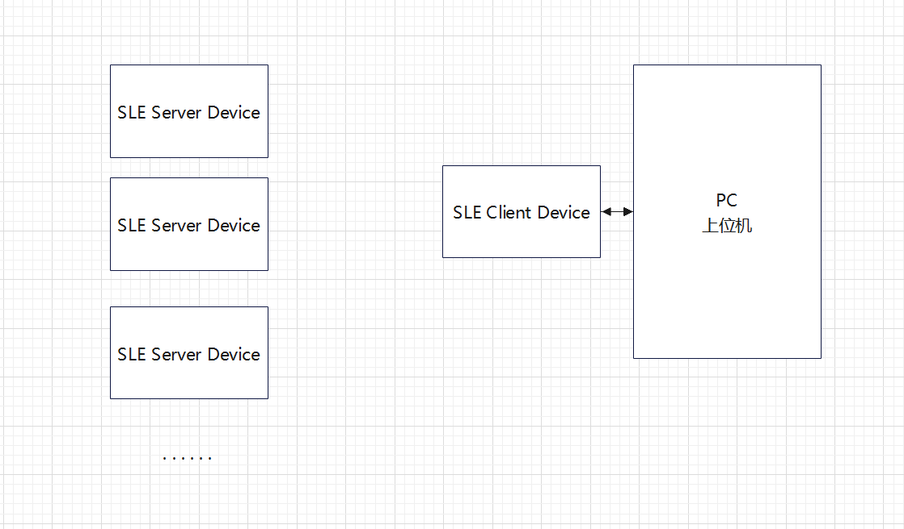

# nearlink_sle_connect_bs21

## 功能框图

### 图片

### 介绍
    本项目使用BS21（hi-2821）作为客户端，使用串口与PC上位机进行连接，通过指定协议，使用上位机进行发现、连接SLE设备以及传输数据等功能，对于SLE Server Device无特殊要求，只需进行广播即可。
#### **注：不同的SLE server Device的MAC地址配置应有区别，若存在相同的MAC地址则会认为是同一设备，从而存在覆盖数据的风险**